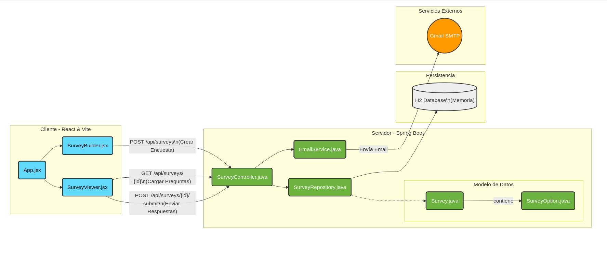

# DIAGRAMA MODELO

## Deploy en Vercel desde GitHub

Para publicar el frontend del proyecto en Vercel usando GitHub, sigue estos pasos:

1. Sube el proyecto a un repositorio de GitHub.
2. Inicia sesión en Vercel y selecciona "Add New Project".
3. Conecta tu cuenta de GitHub y elige el repositorio que contiene este proyecto.
4. En la configuración del proyecto:
   - Si el repositorio tiene tanto el frontend como el backend, selecciona la carpeta "frontend" como Root Directory.
   - Framework Preset: Vite.
   - Build Command: `npm run build`.
   - Output Directory: `dist`.
5. Haz clic en "Deploy".
6. Vercel generará una URL de vista previa y, después de confirmar, una URL de producción.

### Notas importantes
- Cada push a la rama principal del repositorio disparará un nuevo despliegue en Vercel.
- Si la app necesita variables de entorno, agrégalas en Vercel en Settings > Environment Variables.
- Si deseas usar un dominio personalizado, puedes configurarlo desde la sección de Domains en Vercel.
